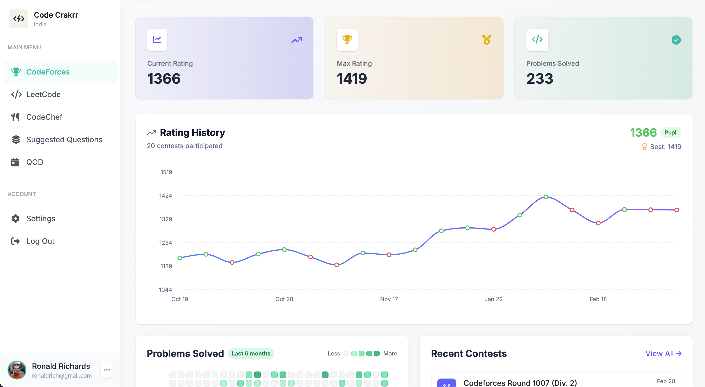

# SolveIQ


A modern web application for tracking and visualizing competitive programming progress across multiple platforms including CodeForces, LeetCode, and CodeChef.

🔗 **Live Demo:** [https://solveiq.vercel.app](https://solveiq.vercel.app)

## Features

- **Multi-Platform Integration:** Connect your CodeForces, LeetCode, and CodeChef accounts in one place
- **Unified Dashboard:** Track your coding progress across all platforms
- **Problem Visualization:** View problems solved by difficulty and topics with intuitive charts
- **Activity Tracking:** Monitor your coding activity with interactive heatmaps
- **AI Recommendations:** Get personalized problem suggestions based on your skill level
- **Daily Questions:** Stay up-to-date with the daily LeetCode problem
- **Responsive Design:** Works on all devices from mobile to desktop

## Screenshots

### Dashboard


### Platform Stats
- CodeForces rating history and recent contests
- LeetCode problem-solving statistics and submission calendar
- CodeChef rating and contest performance

### AI-Powered Recommendations
Get personalized question recommendations based on your current skill level and solved problems.

## Tech Stack

- **Frontend:** React 19, React Router DOM 7
- **Styling:** Tailwind CSS 4, Font Awesome icons
- **Build Tool:** Vite 6
- **Deployment:** Vercel
- **APIs:** 
  - LeetCode API (alfa-leetcode-api.onrender.com)
  - CodeForces API
  - CodeChef API

## Getting Started

### Prerequisites

- Node.js (v18+)
- npm or yarn

### Installation

1. Clone the repository
   ```bash
   git clone https://github.com/yourusername/solveiq.git
   cd solveiq
   ```

2. Install dependencies
   ```bash
   cd client
   npm install
   ```

3. Create environment variables
   ```bash
   # Create a .env file in the client directory
   cp .env.example .env
   # Add your API keys to the .env file
   ```

4. Start the development server
   ```bash
   npm run dev
   ```

5. Open [http://localhost:5173](http://localhost:5173) in your browser

## Deployment

### Deploying to Vercel

1. Fork or clone this repository
2. Connect your GitHub repository to Vercel
3. Configure the build settings:
   - Framework Preset: Vite
   - Root Directory: client
   - Build Command: npm run build
   - Output Directory: dist
4. Add your environment variables in the Vercel dashboard
5. Deploy!

## Usage

1. **Settings:** Start by entering your platform usernames in the Settings page
2. **Platform Pages:** Navigate to each platform page to see your stats
3. **Suggested Questions:** Get AI-recommended practice problems
4. **QOD:** Check the daily LeetCode question

## Project Structure

```
client/
├── public/
├── src/
│   ├── assets/
│   │   ├── components/
│   │   │   ├── codeforces/
│   │   │   ├── leetcode/
│   │   │   ├── codechef/
│   │   │   ├── SQ/
│   │   │   └── ... (common components)
│   │   ├── Static/
│   │   ├── App.jsx
│   │   ├── main.jsx
│   │   └── routes.jsx
│   └── ... (config files)
```

## Environment Variables

Create a `.env` file in the client directory with the following variables:

```
VITE_DEEPSEEK_API_KEY=your_api_key_here
```

## Contributing

Contributions are welcome! Please feel free to submit a Pull Request.

## License

This project is licensed under the MIT License - see the LICENSE file for details.

## Acknowledgments

- Thanks to the developers of the competitive programming APIs
- Special thanks to Alfa-LeetCode-API for providing a reliable LeetCode API
- Icon libraries and design inspiration from various sources

---

Made with ❤️ by [Your Name]
